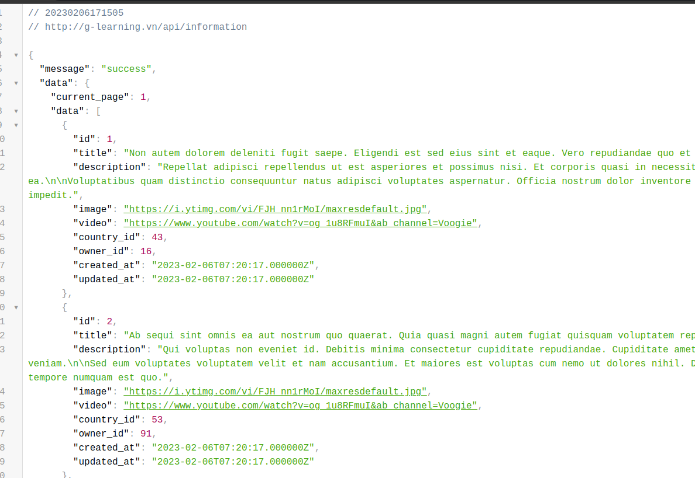

# API endpoints # 

## Host ##

```
https://g-learning.click/

```
1. GET continents
   
   a. endpoint
    ```
    https://g-learning.click/api/continents
    ```
    b. params

        null

    c. response

        array
    d. method

        GET

2. GET countries in a continents
   
    a. endpoint

    ```
    https://g-learning.click/api/continents/{id}

    ```
    b. params

        id ->integer

        example: 1,2

    c. response

        array with popular and countries

    d. method

        GET

3. GET topic of a country
   
    a. endpoint

    ```
    https://g-learning.click/api/countries/{id}/topics
    ```
     b. params

        id ->integer

        example: 1,2

    c. response

        array
    d. method

        GET

4. GET videos of a country topic

    a. endpoint

        https://g-learning.click/api/countries-topics/{id}/videos
    b. params

        id ->integer

        example: 1,2

    c. response

        array
5. Login 
   
    a. endpoint

        https://g-learning.click/api/login
    
    b. params
    
        username: fasfdsdfdsfdsf
        password: 123456789
    c. response

        array

        {
            "message": "success",
            "data": {
                "status": true,
                "token": "4|VCL67xahQpnBQ1GsnoJ1hBOnOJ4vB58UjPxrwLke",
                "type": "Bearer Token"
            }
        }

    d. method

        POST
6. Register
   
    a. endpoint

        https://g-learning.click/api/register
    b. params

        [
            username,
            password,
            password_confirm,
            phone
        ]
    c. response

        array
    d. method

        POST
    e. Example

    

7. Search
    
    a. endpoint

        https://g-learning.click/api/countries-topics/{id}/videos?s={search}
    b. params

        id -> integer
        search-> string
    c. response

        array
    d. example

    

    e. method

        GET
    f. note

        Please need to search from 2 symbols

8. Get information in maybe you don't know
   
    a. endpoint

        https://g-learning.click/api/information

    b. param
    
        null

    c. response

        an array with paginate

    d. example

    
    


    
